% Inventory Management System (IMS)  Official User Guide  
% Team CodeBaddies  
% May 2025  

### Project Contributors
- [@Delinquent-Pointer](https://github.com/Delinquent-Pointer)  
- [@Jared-Schimpf](https://github.com/Jared-Schimpf)  
- [@Pbrown34](https://github.com/Pbrown34)  

# Table of Contents
- [Table of Contents](#table-of-contents)
- [1. Prerequisites](#1-prerequisites)
- [2. Installation](#2-installation)
- [3. Uninstallation](#3-uninstallation)
- [4. Quick Start](#4-quick-start)
- [5. Feature Walkthrough](#5-feature-walkthrough)
  - [5.1 Login](#51-login)
  - [5.2 Create Account](#52-create-account)
  - [5.3 Account Settings](#53-account-settings)
  - [5.4 Product Creation](#54-product-creation)
  - [5.5 Product Management](#55-product-management)
    - [5.5.1 Product Searching](#551-product-searching)
    - [5.5.2 Product Popup](#552-product-popup)
    - [5.5.2 CSV Upload \& Download](#552-csv-upload--download)
  - [5.6 Inventory Alerts](#56-inventory-alerts)
  - [5.7 Main Dashboard](#57-main-dashboard)
  - [5.8 IT Dashboard](#58-it-dashboard)
  - [5.9 Sales Page](#59-sales-page)
- [6. Additional Information](#6-additional-information)
  - [6.1 Password Requirements](#61-password-requirements)
  - [6.2 SKU Requirements](#62-sku-requirements)
- [7. Troubleshooting](#7-troubleshooting)
  - [Docker Issues](#docker-issues)
  - [PowerShell Issues](#powershell-issues)
  - [Login / UI Issues](#login--ui-issues)
  - [Database Issues](#database-issues)
  - [General Tips](#general-tips)
- [8. Contact](#8-contact)
- [9. License \& Academic Use](#9-license--academic-use)
    - [Usage Notice](#usage-notice)
    - [Educational Scope](#educational-scope)
    - [Contact for Permissions](#contact-for-permissions)

# 1. Prerequisites

Before installing or running the Inventory Management System (IMS), ensure the following tools and access credentials are available:

- **Docker Desktop**  
  Ensure Docker is installed and running on your system.  
  [Download Docker Desktop](https://www.docker.com/products/docker-desktop/)

- **.NET SDK 9.0.301**  
  Required to build and run the IMS web application locally.  
  [Download .NET 9.0.301](https://dotnet.microsoft.com/en-us/download/dotnet/9.0)

- **Git**  
  Git is required to clone the project repository.  
  [Download Git](https://git-scm.com/downloads)

- **Code Editor (Recommended: Visual Studio Code)**  
  For editing, running, and debugging the project.  
  [Download VS Code](https://code.visualstudio.com/)

- **Powershell 7 (Recommended Terminal)**  
  For running scripts.
  [Download Powershell 7](https://learn.microsoft.com/en-us/powershell/scripting/install/installing-powershell-on-windows?view=powershell-7.5)

- **GitHub Access**  
  - **Developer Repository**: [Delinquent-Pointer/IMS](https://github.com/Delinquent-Pointer/IMS)  
  - **Public Docker Showcase**: [IMS-Docker](https://github.com/Delinquent-Pointer/IMS-Docker)

- **Access Credentials (Admin/Database) [Only if building Azure cloud service]**  
  Some functionality requires access credentials (e.g., `admin password, database connection string`). These can be obtained from your Azure portal or deployment lead.  
  [Access Azure Portal](https://portal.azure.com/)

# 2. Installation

      **Step 1: Download the IMS Docker Bundle**

      - Visit the latest release on GitHub: [IMS Docker Releases](https://github.com/Delinquent-Pointer/IMS-Docker/releases)

      - Download the `.zip` file containing Docker images and setup scripts.

      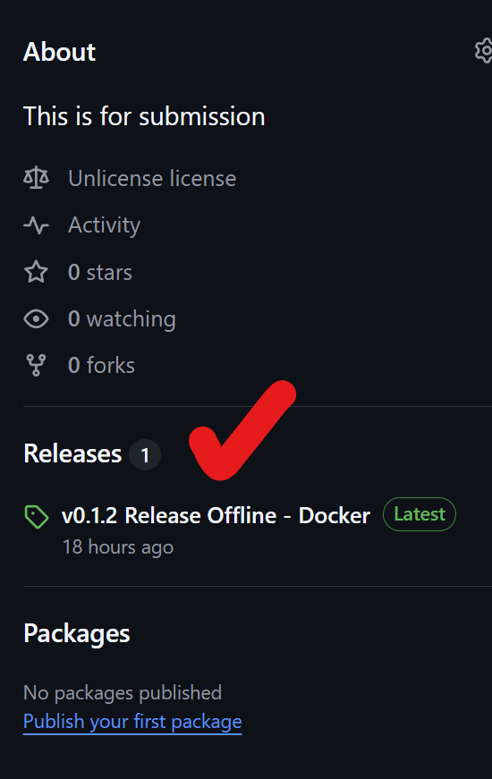
      

      **Step 2: Extract the ZIP File**

      - Right-click the downloaded archive and choose **Extract All**.

      - Extract to a preferred location (e.g., `Documents\IMS`).

      **Step 3: Open PowerShell in the Project Directory**

      - Navigate into the extracted folder

      - Locate the folder containing `install.ps1`

      - Right-click and choose **Open in Terminal**

      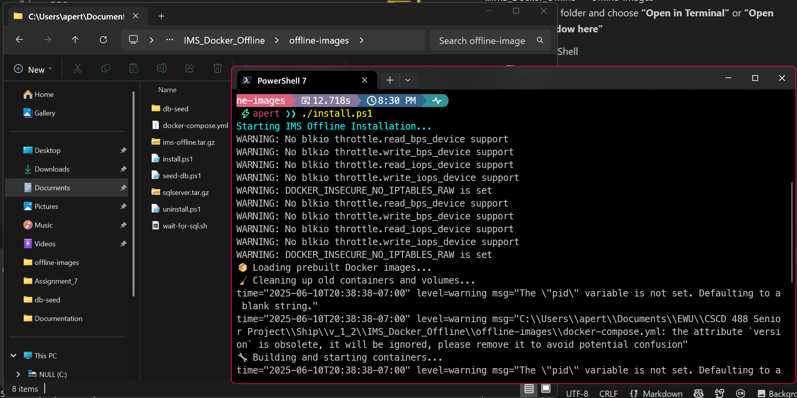

      **Step 4: Ensure Docker Desktop Is Running in Linux Mode**

      - Launch Docker Desktop

      - Right-click the Docker tray icon and select **Switch to Linux containers** if needed

      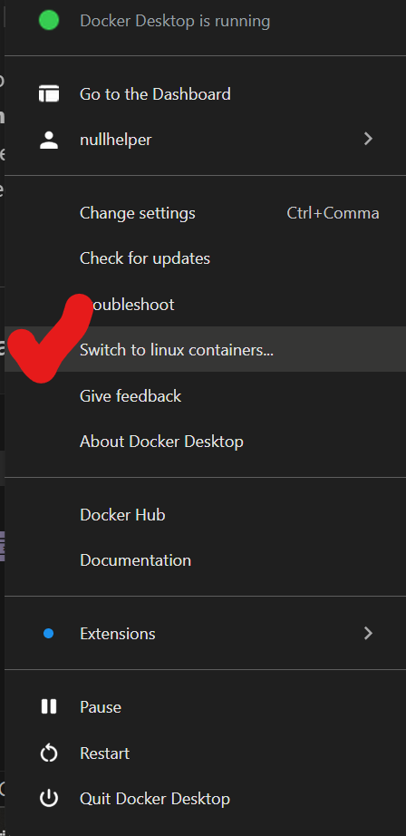

      **Step 5: Run the Installation Script**

      In PowerShell, enter:

      `./install.ps1`

      This will load Docker images and start the IMS containers.

      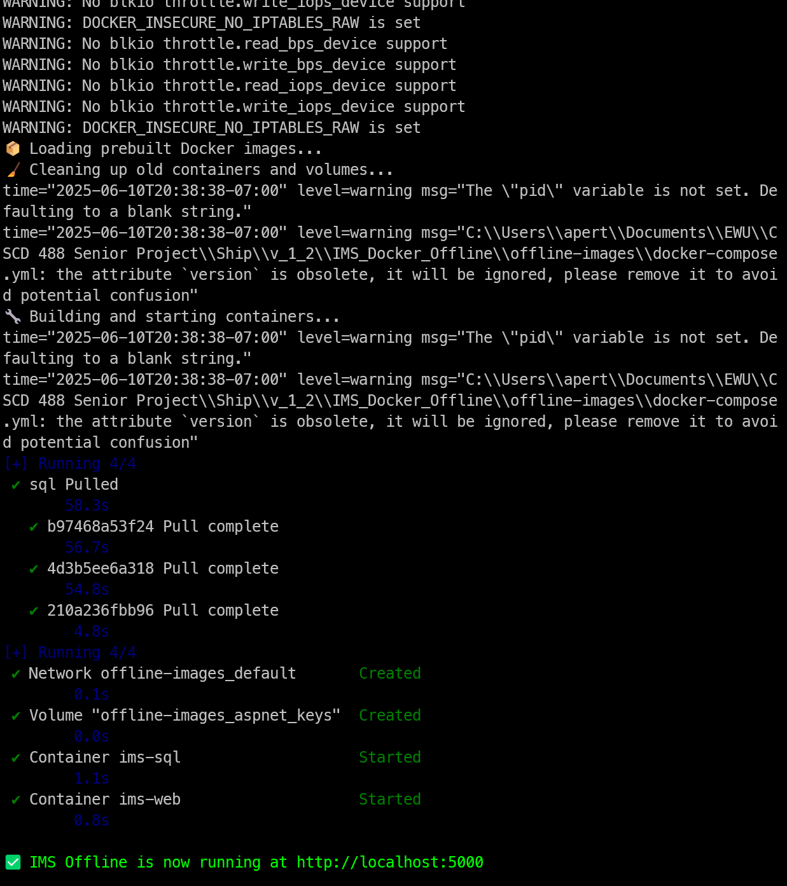

---

# 3. Uninstallation

      **Step 1: Locate `uninstall.ps1`**

      - Navigate to the same folder where `install.ps1` was run.

      - You should see a file named `uninstall.ps1`.

      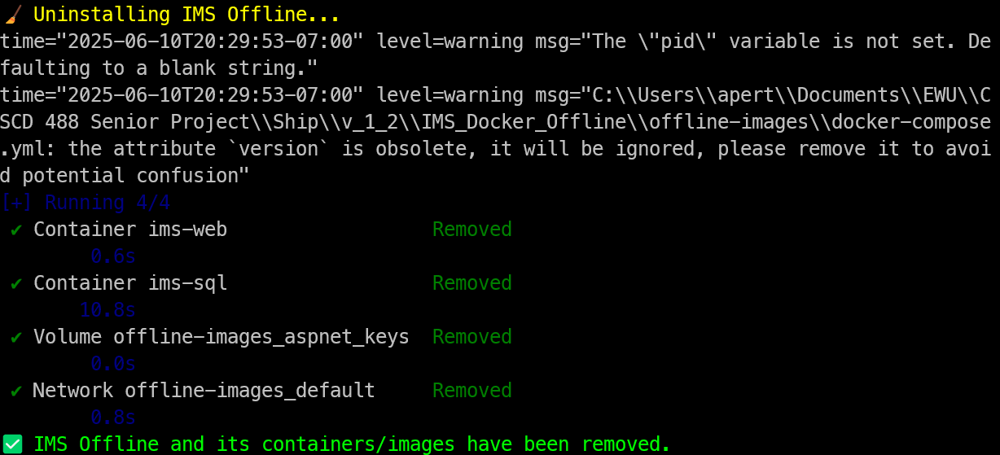

      **Step 2: Run the Script in PowerShell**

      - Open PowerShell in that directory

      - Enter:

      `./uninstall.ps1`

      This will stop containers and remove related Docker images.

      **Step 3: Manually Verify in Docker Desktop**

      - Open Docker Desktop

      - Confirm IMS-related containers and images are removed

      - Delete anything left over

      
      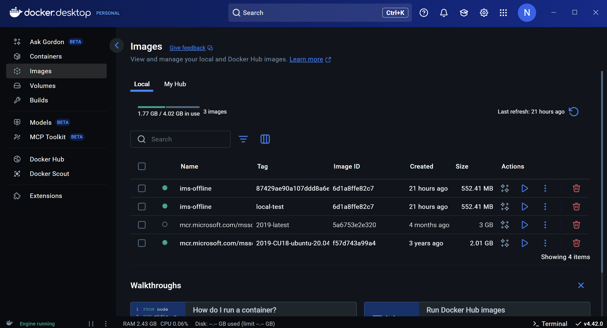

    **Done:** IMS has been fully removed. You may now delete the project folder.

# 4. Quick Start

> **Note:** This section is only applicable if the application is hosted on Azure. If you are running IMS locally or offline, please refer to [Installation](#2-installation).

If the IMS is already hosted on Azure, you can skip local setup and access it directly via the live deployment link below:

 **Live App**: [https://inventorymanagementsystem-cceeg6b6cbgsebhk.westus-01.azurewebsites.net](https://inventorymanagementsystem-cceeg6b6cbgsebhk.westus-01.azurewebsites.net)

Once the page loads, begin by logging in. Refer to [Section 5.1  Login](#51-login) of this guide to proceed.

---

If you're not using the Azure deployment, follow the installation steps to run the system locally using Docker:

Access at http://localhost:5000

# 5. Feature Walkthrough
This section walks through the login process for your first visit of the webpage, as well as an overview of the functionality of each webpage. 
## 5.1 Login

    **The Login page is used to validate access the inventory system via a verified account.**
    This is the first page displayed wehn accessing the website, it can also be accessed via the "Login" option located on the navigation bar while signed out.

    First Login:
      
        - Navigate to the login page.
        - Use the provided demo account or a previously registered account.
      
**The demo account's login is:**
      
        - **Username: Admin** 
        - **Password: Password1!** 

      - We recommend you visit the Account settings page and change this account's information after your first login, as this information is default to all new IMS instances and may present a vulnerability.
        - Use this account as a starting point to create more accounts with or without IT permissions.

      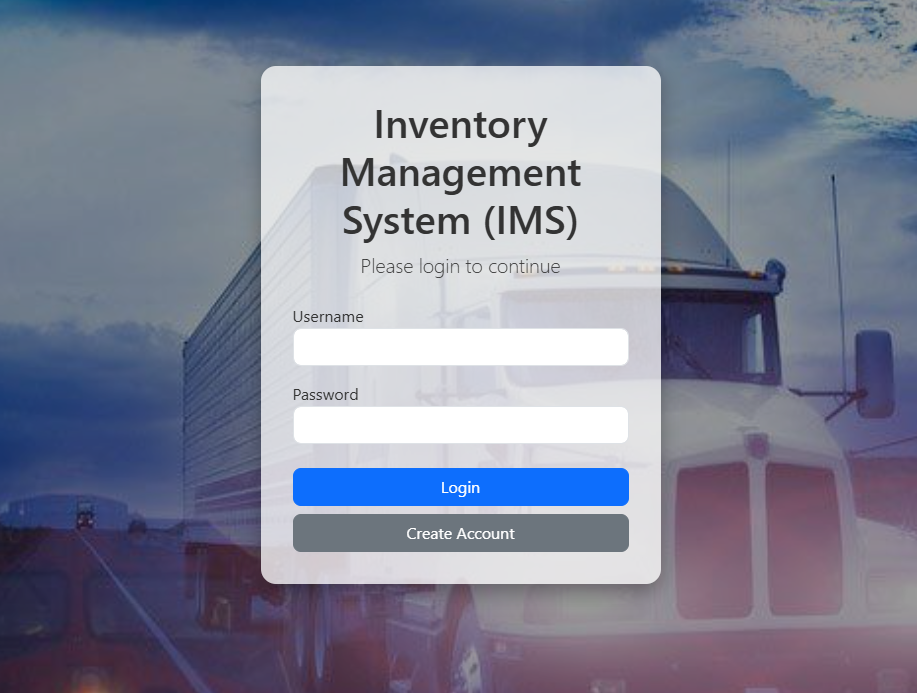

## 5.2 Create Account

    **The Create Account page is used to create new User and I.T. User accounts which are required to access the inventory system.**

    To access this page, press the "Create Account" button located on the Login page or the "Create Account" option located on the navigation bar while signed out.

    Account creation:
    
      - To create an account, enter a unique username and a password. Password creation follows the requirements outlined in 6.1 Password Requirements.
      - Created accounts must first be verified by an Administrator for Login capability.
    
    IT Account Creation:
    
    - To create an I.T. Account, the Admin Key of an existing Administrator is required. It is recommended for the sake of security that Administrators create accounts for new Administrators and provide them the account details rather than distribute their own Admin Key.
      - A fresh Admin Key will be generated for each IT account. this key can be changed by visiting the Account Settings page as an IT user.

      

## 5.3 Account Settings

    **The Account Settings page provides functionality to modify existing account information for the currently logged in account.**

    To access this page, press the "Manage Account" option on the navigation bar.

    Editing Account Information:
      
      - New usernames must be unique.
      - New passwords must meet the requirements outlined in 6.1 Password Requirements.
      - Administrators will see an option to edit their admin key. An updated key can be any permutation of 8 or more alphanumeric characters.
      - Changes made to the current account information must be confirmed with the user's current password.

        
        

## 5.4 Product Creation

    **The Create Product page is used to create new product information which is entered into the inventory database.**

    To access this page, press the "Create New Product" option on the navigation bar.

    Creating a Product:
    
      - To create a product, enter the relevant information into the fields.
      - The only required field to create a product is name. There is no uniqueness requirement for product names.
      - The formatting requirements for a product's SKU are outlined in 6.2 SKU Requirements.

      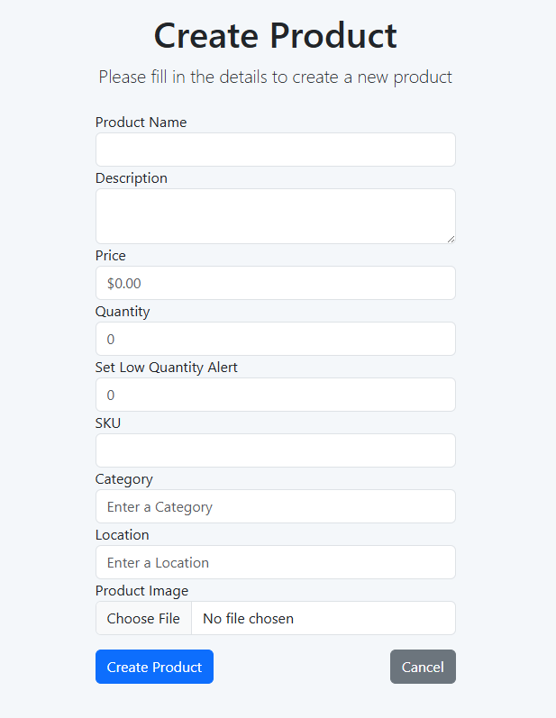

## 5.5 Product Management

    **The Inventory page provides a range of functionality for viewing, searching, and updating the inventory database.**

    To access this page, press the "Inventory" option on the navigation bar.

    Included Features:
      
        - Inventory searching by category
        - Advanced Searching by multiple categories
        - Product information popups with editing and deletion.
        - Direct upload of CSV tables to the inventory
        - Downloading the current search result to a CSV file

        

### 5.5.1 Product Searching

**Located at the top of the page is a search bar which can search the inventory list for products based off of certain categories.**

Search Categories:
  
    - Name
    - Description
    - Price
    - Quantity
    - SKU
    - Category
    - Location
    - Advanced Query
  
Advanced Query:
  
    - The advanced Query option allows for multiple different catagories to be searched at once.
    - Advanced queries can be typed manually or can be build using the query builder, which is accessible by pressing the "Build Query" button when the Advanced Query category is selected.

        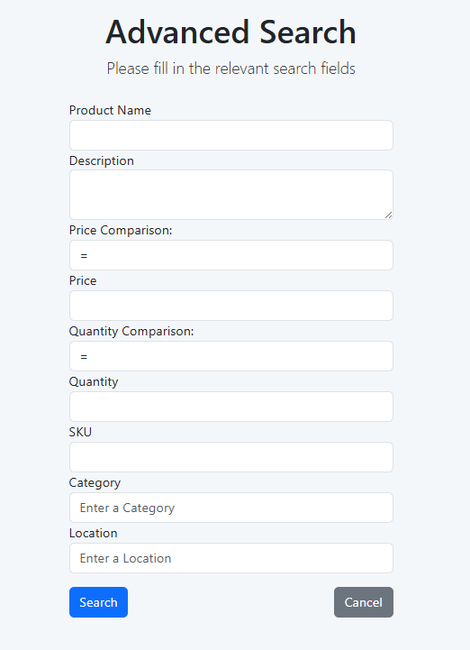

### 5.5.2 Product Popup

    **Selecting a product from the inventory table will display a popup which lists the full product information. This popup also provides functionality to edit the individual product fields or delete the product from the database.**

Popup Options:
  
    - Pressing the "Edit" button will allow you to update all of the selected product's fields, pressing "Save Changes" will confirm these changes.
    - Pressing the "Delete" button will prompt a secondary confirmation popup to delete the item from the database. Pressing "Confirm" will fully remove this item from the database.

        

### 5.5.2 CSV Upload & Download

    **CSV files can be directly uploaded and Downloaded form the inventory page. Uploaded CSVs will populate their table information directly into the inventory database. Downloaded CSVs are populated with the current search results.**

CSV Upload:
  
    - The Inventory page supports the ability to directly upload CSV table information to the inventory.
    - Uploaded CSV's are required to have a header and must be comma-separated.
    - The only required field for a CSV is Name, though all included fields must have a header.
    - Pressing the "Choose File" button will allow you to choose the file to upload.
    - Pressing the "Upload" button will attempt to upload the file contents to the database.
    - A error popup will appear if the uploaded file is incorrectly formatted or contains bad data.

CSV Download:

  - The Inventory page supports the ability to directly download the current search result as a comma-separated CSV file.
  - Pressing the "Download" buttom wild initiate a download of the current search result as a CSV file.
  - Attempting to download an empty search result will instead give you a CSV of the full inventory.

## 5.6 Inventory Alerts

      **The Inventory Alerts system notifies users when item quantities fall below set thresholds.**

      Users can configure alerts by editing a product and specifying a "notify me when below" value.

      These alerts are visible on both the dashboard and the calendar view for the associated product.

      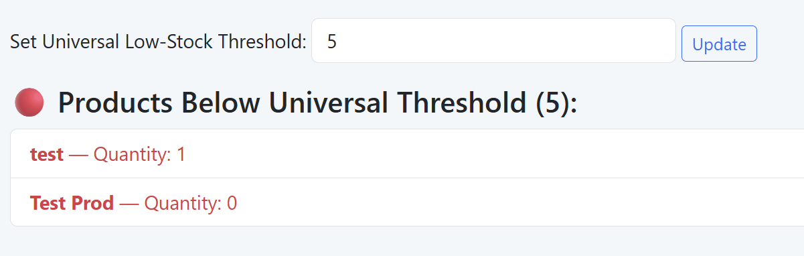

---

## 5.7 Main Dashboard

        - Monitor pie chart, alerts, and scanning activity.
        - Use filters to query data.
        - To use the Scanner, you must have a Camera on the device you are using.
          
            - It will auto-detect your Camera and ask for permission to use it.
            - Scan items based off of their SKU using a printed barcode.
            - Currently there is no integrated barcode generator.
              
                - Use: [Barcode.tec-it](https://barcode.tec-it.com/en)
                - Recommended type: **Code-128**

            - After scanning, click **'Complete Transaction'** to:
              
                - Deduct scanned item quantities from inventory.
                - Generate a receipt on the Sales Page.

      

      **Chart Selection:**

      Visualize current inventory using customizable chart types such as pie and bar charts. Use the dropdown to change views.

      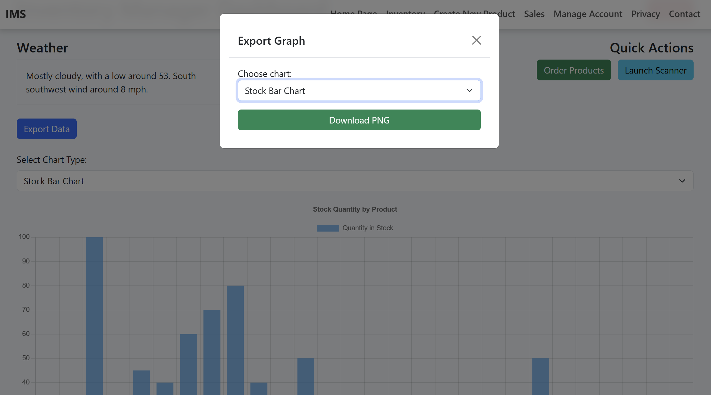

      **Quick Product Search:**

      Use the quick search bar for instant filtering of products based on name, SKU, or category. Designed for fast barcode-driven use.

      

      **Interactive Notes:**

      Notes added to items show up on the dashboard calendar with timestamps. Useful for tracking reminders, stock actions, or alerts.

      

## 5.8 IT Dashboard

      **The IT Dashboard allows IT users or Admins the ability to verify and delete accounts.**

        - This page is only visible to users with Admin privileges.
        - To verify a new account, press the Verify button.
        - To delete any account, press the Delete button.
        - This page lists the following:
          
            - Username
            - ID
            - Account Type (General User or IT User)
            - Verified Status
            - Actions

      

## 5.9 Sales Page

        - The Sales page, found by clicking on Sales on the navigation bar, is basic.
        - It is a page dedicated to housing Receipts made by the Scanner on the Dashboard page.
        - It displays:
          
            - Product
            - Quantity
            - SKU
            - Price of each item
            - The total of each item
            - The total of the entire purchase
            - Transaction ID
            - Date/Time

      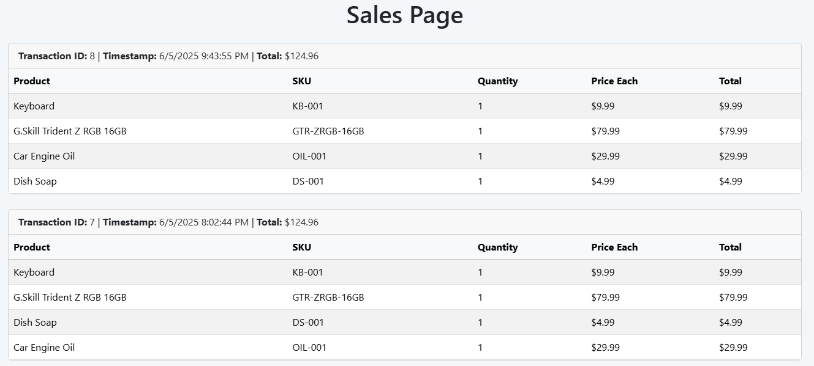

# 6. Additional Information
Notable information referenced by one or more pages.
## 6.1 Password Requirements

      The creation and modification of any account passwords must comply with the following enforced requirements.

      **Password Requirements:**
      
        - At least one uppercase letter
        - At least one lowercase letter
        - At least one special character
        - At least one digit
        - No whitespace characters
        - At least 8 Characters

## 6.2 SKU Requirements

      The creation and modification of product SKUs must follow the following enforced format requirements.

      **SKU Formatting:**
      
        - SKUs are defined by multiple 'categories' separated by dashes.
 e.g: `AAAA-BBBB` 
        - A category must only contain capital letters and digits
        - The initial category of an SKU must be 1-5 characters long
        - Any following categories are 'subcategories', and can be 1-5 characters long
        - An SKU can have at most 4 categories,
 i.e: a single main category and three following subcategories.

# 7. Troubleshooting

This section lists common problems encountered during installation or use of the Inventory Management System (IMS), along with suggested fixes.

---

## Docker Issues

- **Docker Not Running**
  - Ensure Docker Desktop is open and running in the background.
  - If unsure, check for the Docker whale icon in the system tray.

- **Docker Not in Linux Mode**
  - IMS requires Linux containers. If Docker is set to Windows containers:
    1. Right-click the Docker icon in the system tray.
    2. Select **"Switch to Linux containers..."**.
    3. Wait for Docker to restart.

- **Containers Don't Start After Running `install.ps1`**
  - Ensure no previous IMS containers are running by opening Docker Desktop and checking under **Containers**.
  - Try running `docker-compose down` before reinstalling.

- **Ports Already in Use**
  - If `localhost:5000` or other required ports are occupied, change the port in `docker-compose.yml` or stop other running apps.

---

## PowerShell Issues

- **Scripts Not Executing (`install.ps1` or `uninstall.ps1`)**
  - Make sure you are running PowerShell **as Administrator**.
  - If blocked, run this command to allow script execution temporarily:
    ```powershell
    Set-ExecutionPolicy -ExecutionPolicy RemoteSigned -Scope Process
    ```

---

## Login / UI Issues

- **Cannot Log In with Demo Credentials**
  - Double-check credentials (case-sensitive):  
    `Username: Admin`  
    `Password: Password1!`
  - Make sure the backend is up and running (visit `http://localhost:5000`).
  - Check browser console or network tab for backend errors.

- **UI Not Loading or Blank Page**
  - Ensure the frontend service container (`ims-web`) is running.
  - Check browser dev tools (F12) for any JavaScript or network errors.
  - Refresh with hard cache clear: `Ctrl + Shift + R`.

---

## Database Issues

- **Database Connection Failed**
  - Confirm the `ims-sql` container is running in Docker.
  - Ensure the connection string in your config matches the SQL container name and credentials.

- **No Data After Startup**
  - The database starts empty. Use the demo login and begin adding data, or import a CSV file.

---

## General Tips

- **Reset Everything**
  - If things get stuck, try this sequence:
    ```bash
    docker-compose down
    docker system prune -af
    ./install.ps1
    ```

- **File Permission Errors (on Unix/macOS)**
  - Run `chmod +x install.sh` or `chmod +x uninstall.sh` if shell scripts fail to run.

- **Still Stuck?**
  - Delete all containers and images via Docker Desktop, then reinstall.
  - Or, contact your project team (see [Contact](#8-contact) section).

# 8. Contact

For questions, bug reports, or feature requests, please reach out to the project maintainers:

- GitHub Repository: [CodeBaddies IMS Project](https://github.com/Delinquent-Pointer/IMS)
- Team Members:
  - [@Delinquent-Pointer](https://github.com/Delinquent-Pointer)
  - [@Jared-Schimpf](https://github.com/Jared-Schimpf)
  - [@Pbrown34](https://github.com/Pbrown34)

# 9. License & Academic Use

This project was developed as part of a university capstone course and is the intellectual property of the contributing team members.

### Usage Notice
- This software and its documentation are provided **strictly for academic purposes**.
- **Copying, redistributing, or using this project (or any part of it) without prior written permission is not authorized.**

### Educational Scope
- The Inventory Management System (IMS) was created to demonstrate understanding of full-stack development using .NET, Docker, and SQL Server.
- Any use beyond academic review or instruction requires explicit consent from all project contributors.

### Contact for Permissions
Please contact the project team for any inquiries about reuse or demonstration:
- [@Delinquent-Pointer](https://github.com/Delinquent-Pointer)
- [@Jared-Schimpf](https://github.com/Jared-Schimpf)
- [@Pbrown34](https://github.com/Pbrown34)